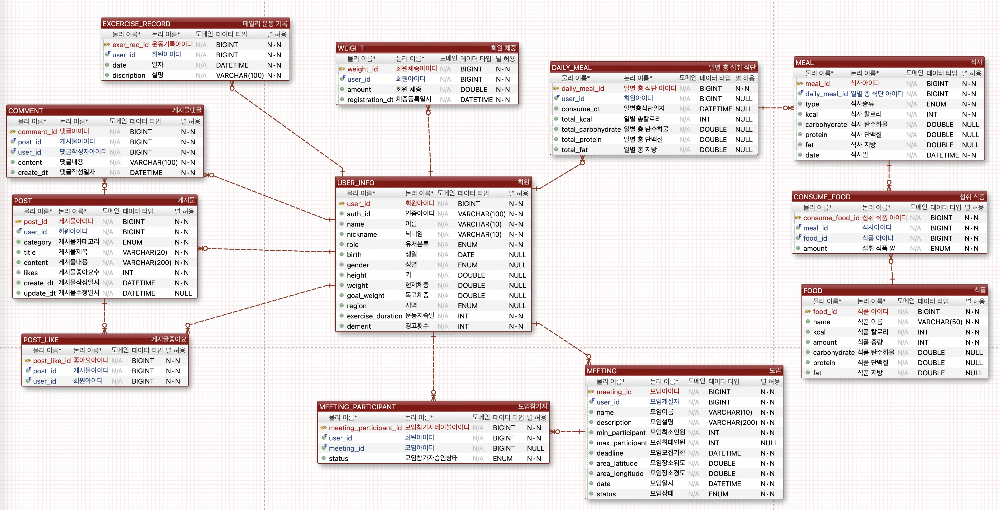

# 다이어트 식단 & 운동 커뮤니티

내가 섭취한 식단의 정보를 관리하고 사용자들과 식단, 운동정보를 공유할 수 있는 서비스입니다

---

## 사용 기술
Spring boot, Spring Security, Naver OAuth2, MariaDB, Redis, Elastic Search

---

## ERD

## 프로젝트 기능 및 설계

### [회원가입 & 로그인]
- Naver OAuth2를 사용해 로그인 할 수 있다.
  - 로그인할 시 Naver에서 이름, 성별을 가져오며 데이터베이스에 회원 정보가 추가된다.
- 닉네임은 최초 가입 시 단어 조합으로 랜덤 닉네임이 부여되며 추후 유저가 닉네임 정보를 수정할 수 있다. 
Naver Login api 명세 : https://developers.naver.com/docs/login/api/api.md

### [마이페이지]

- 몸무게 정보를 조회할 수 있다.
  - 몸무게 정보 조회 시 처음몸무게, 현재몸무게, 몸무게 감소량이 보여진다.
- 오늘 섭취한 칼로리와 섭취 가능한 잔여 칼로리를 조회할 수 있다.
- 총 운동 일수, 연속으로 운동한 일수를 조회 할 수 있다.
- 닉네임, 나이, 키, 몸무게, 희망 몸무게, 사는 지역(도 단위)의 정보를 입력, 수정 가능하다

### [운동 기록]

- 운동 기록을 일기 형식으로 등록할 수 있다.
- 등록한 운동 기록은 조회, 수정, 삭제가 가능하다.
- 운동 기록 등록, 수정, 삭제 시 연속으로 운동한 일 수가 계산돼서 유저 정보에 업데이트 된다.
- 운동 지속일은 운동을 계속할 경우 누적되고 운동을 쉬면 0일로 변경된다.
  - 매일 자정에 스케쥴링을 통해 해당 일자의 운동 기록이 없는 유저의 경우 운동 일수를 초기화 한다.

### [몸무게 추이]

 - 등록한 사용자의 몸무게 정보들을 조회할 수 있다.
   - 10개씩 페이징 처리된다.
   - 파라미터(day, week, month)로 조회 간격을 설정할 수 있으며 week와 month의 경우 해당 범위의 마지막 값을 반환한다.
- 사용자가 본인의 현재 몸무게를 등록, 수정 삭제 할 수 있으며 수정, 삭제 시 자동으로 유저의 몸무게 정보가 업데이트 된다.

### [식사 기록]

- 공공데이터에서 제공된 음식정보를 데이터베이스에서 조회가 가능하다.
  - 식품의약품안전처_식품영양성분DB정보 open api : https://www.data.go.kr/data/15127578/openapi.do#tab_layer_detail_function
  - 식품 데이터는 스케쥴러를 사용해 자정마다 데이터베이스로 업데이트된다.
  - 일부가 일치하는 검색어로 검색이 가능하다. (ex:  새우 -> 새우, 새우깡)
  - 10개씩 페이징 처리된다.

- 일별로 해당 일자에 섭취한 식사 정보를 조회 할 수 있다.
  - 권장 칼로리와 해당 일자에 섭취한 칼로리를 계산해 보여주고 추가로 섭취할 수 있는 칼로리도 보여준다.

- 식사 정보를 등록하기 위해선 우선 해당 일자에 식사를 추가해야 한다.
  - 식사 종류에는 '아침, 점심, 저녁, 추가식사'가 있다.
- 추가한 식사에는 섭취한 음식 정보를 추가할 수 있다.
  - 섭취 음식 정보 추가에는 음식코드, 섭취량(1/4, 1/2, 3/4, 1)이 필요하다.

- 식사 정보 추가 시 총 섭취한 칼로리, 탄수화물, 단백질, 지방 정보가 계산된다.
- 식사 정보는 수정, 삭제할 수 있으며 수정, 삭제시 섭취한 영양성분의 정보가 업데이트 된다.

### [식단 공유 게시판]
- 식단 공유 게시판에 사용자가 게시글을 올릴 수 있으며 댓글을 달 수 있다.
- 게시자를 제외한 다른 사용자는 해당 게시물에 좋아요를 표시할 수 있으며 최다 좋아요 갯수 5위까지의 게시물을 조회할 수 있다.

### [운동 모임]
- 운동 모임 모집 글 작성자가 자동으로 방장으로 배정되며 모집 글 작성시엔 최소인원, 모집 마감 기한, 장소, 일시, 제목, 설명의 
정보가 필요하다.
- 사용자는 모집 글들을 조회할 수 있다.
  - 조회시 전체, 지역별 (도 단위)로 조회가 가능하다.
  - 10개씩 페이징 처리된다.
- 사용자는 모집글에 참여 요청을 할 수 있으며 이후 방장이 허가해야 참여가 가능하다.
- 마감 기한까지 최소인원 미달시 모임은 자동으로 취소된다.
  - 모임 마감기한은 일별로 설정 가능하다.
  - 매일 자정에 스케쥴러를 이용하여 마감일이 지난 모임의 경우 모임 상태가 업데이트 된다.
- 운동 모임의 상태에 따른 status 값은 아래와 같다.
  - RECRUITING : 모집 중 
  - FULL : 인원이 가득 참
  - SCHEDULED : 최소 인원이 충족 & 모집이 마감
  - CANCELED : 모집일까지 모집인원을 충족하지 못함
  - CLOSED : 모임을 성공적으로 마침
- 참여자가 캘린더 등록 기능 호출 시 Naver calender 일정 추가 api를 사용하여 네이버 캘린더에 자동 등록된다. 
Naver Calender api 명세 : https://developers.naver.com/docs/login/calendar-api/calendar-api.md
- 방장은 모임에 참가 신청하고 참여하지 않은 참여자에게 벌점을 부과할 수 있다
  - 벌점이 3점을 초과하면 해당 이용자는 블랙리스트 처리 돼 운동 모임 서비스 이용이 불가능하다

---
